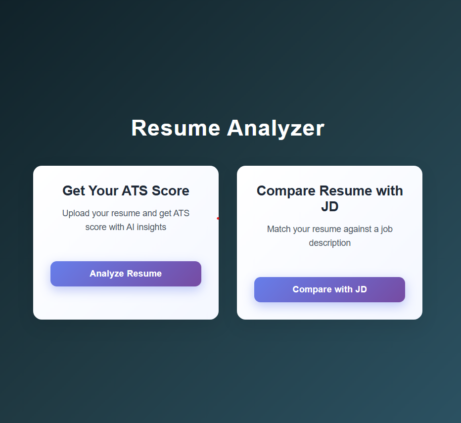
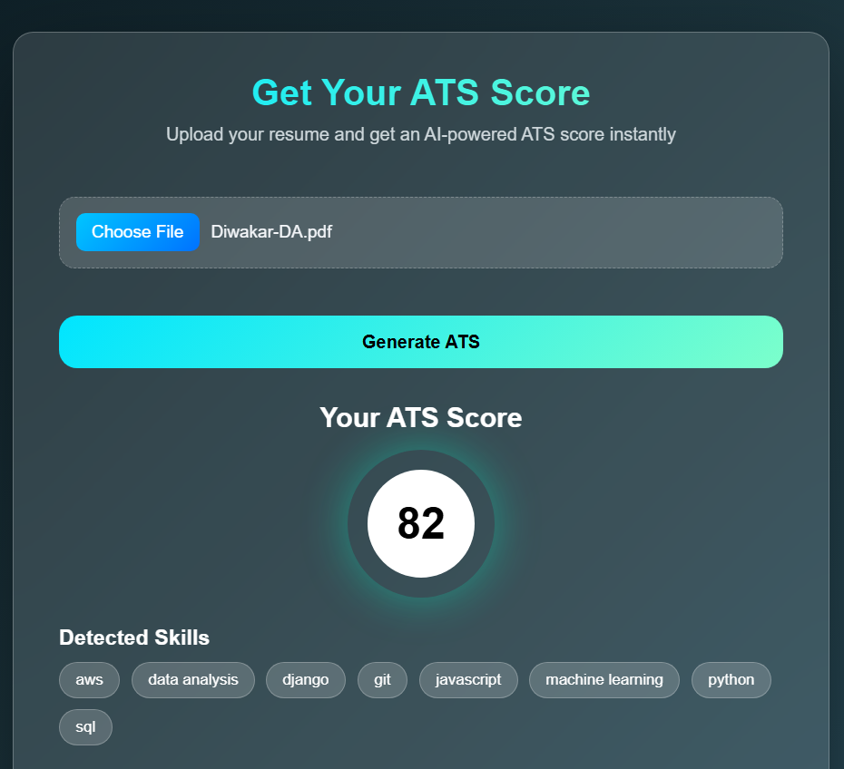
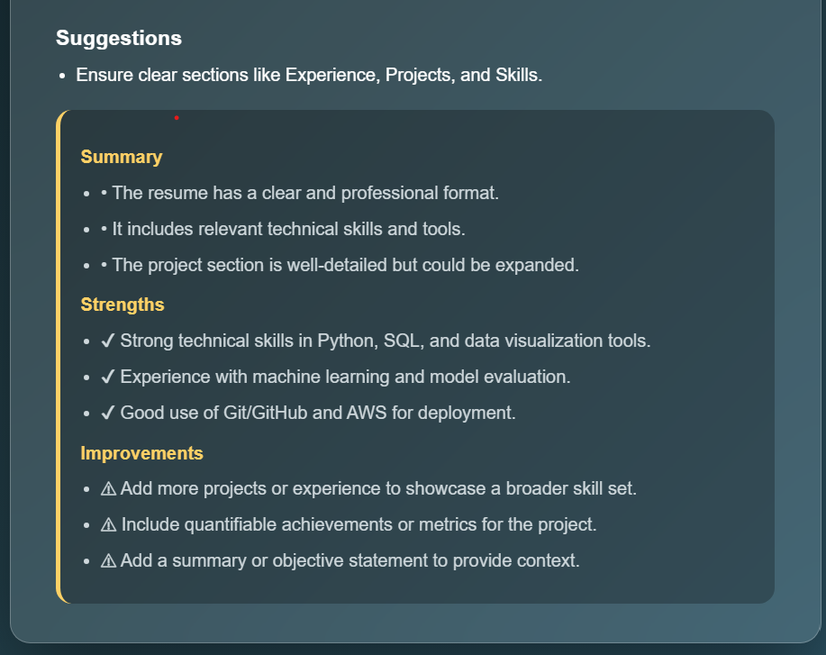
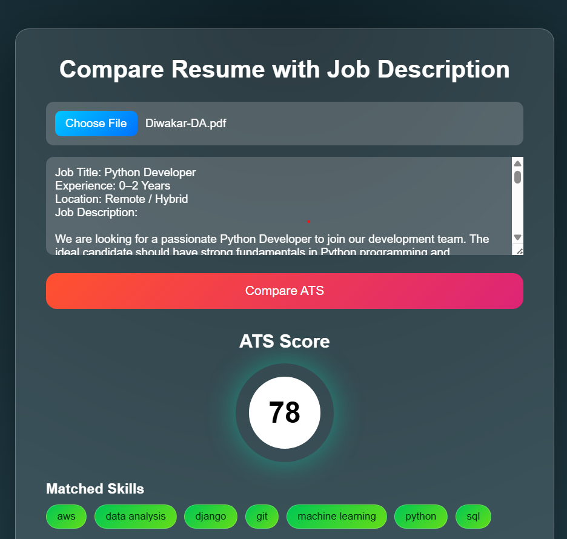
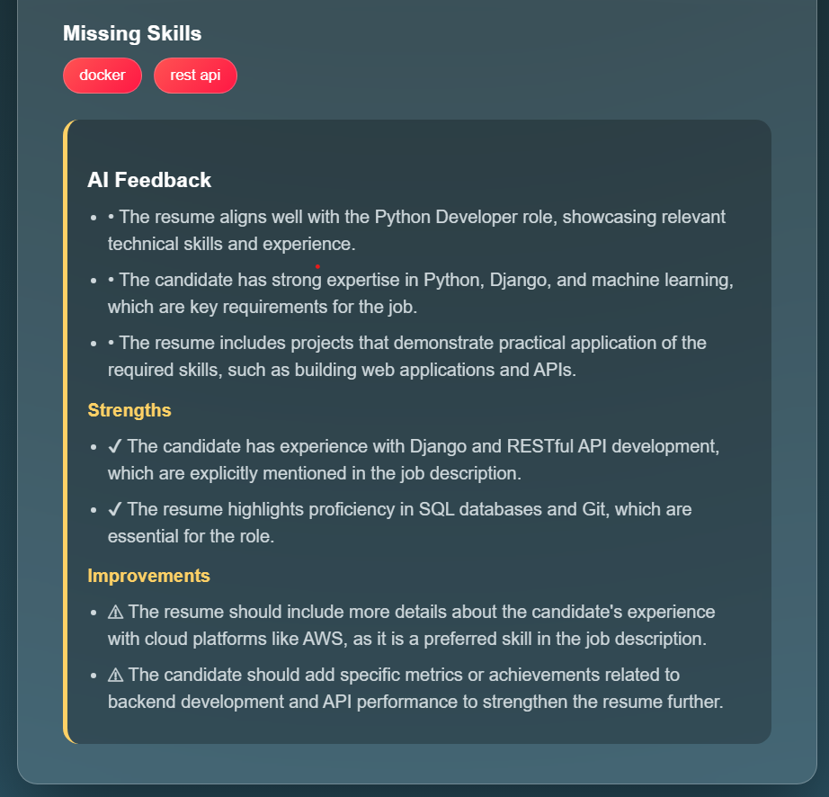

# 🚀 Resume Analyzer – ATS Score & Resume–JD Matching

An AI-powered **Resume Analyzer** that helps candidates:
- Check **ATS score without Job Description**
- Compare **Resume vs Job Description (JD)** for ATS compatibility
- Get **AI-generated actionable feedback** using LLMs
- Understand strengths, gaps, and improvements clearly

Built with **React (Vite)** frontend and **Django REST Framework** backend, powered by **RAG + LLM (OpenRouter)**.

---
[Deployed Link](https://resume-analyzer-phi-tawny.vercel.app/)

## 📸 Screenshots
### Home Page

### Resume ATS

### Job Description VS Resume

---
## 🌟 Features

### ✅ Resume ATS Score (No JD)
- Upload resume (PDF/DOC/DOCX)
- Instant ATS score
- Skill extraction
- Resume structure validation
- AI feedback in **short, readable bullet points**

### ✅ Resume vs Job Description ATS
- Upload resume + paste JD
- Semantic matching using embeddings
- ATS score based on JD relevance
- Gap analysis & improvement suggestions

### ✅ AI-Powered Feedback
- Uses **LLM (Mistral 7B via OpenRouter – Free tier)**
- Structured output:
  - Summary
  - Strengths
  - Improvements
- Clean fallback handling if AI is unavailable

---

## 🧱 Tech Stack

### Frontend
- ⚛️ React (Vite)
- 🎨 Custom CSS (Animations, Modern UI)
- 🌐 Fetch API

### Backend
- 🐍 Django
- 🔗 Django REST Framework
- 🧠 Sentence Transformers (Embeddings)
- 🔍 RAG-based semantic analysis
- 🤖 OpenRouter LLM (Mistral 7B – Free)

---

